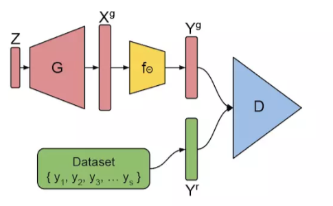
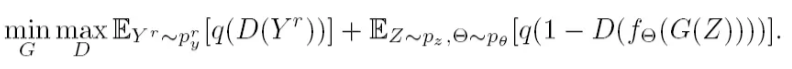

# AmbientGAN:Generative models from lossy measurements

---

## 环境GAN：从有损测度中生成模型

**摘要：**
生成模型提供了一种对于复杂分布中结构进行建模的方式，并且已经被证明可用于很多实际感兴趣的任务中。但是，现在训练生成模型的技术需要访问完全可观测（fully-observed）的样本。在很多场景中，获取完全可观测的样本是昂贵的甚至不可能的，但是获取部分的有噪声的观测样本是比较实惠的。我们考虑在只给予感兴趣的分布的样本的有损失观测情况下，学习一个隐式的生成模型的任务。我们证明了即使在测度模型的某个类的每个样本信息丢失的情况下，真正隐藏的分布也可以被恢复。基于此，我们提出了一种我们称之为环境GAN（**AmbientGAN**）的新的训练生成对抗网络的方法。在三个基准数据集和对于很多测度模型而言，我们证实了方法实质性的定性和定量的改进。用我们方法训练的生成模型可以获得比基准高2-4倍的初始分数（inception score）。

---

#原理

本文提出的模型很简单，就是生成器需要去拟合的数据分布并不可直接得到，但是知道经过一些处理后得到的原数据的有损数据，并且知道这个处理的过程，于是采用有损数据，并将处理过程整合到GAN的架构中，获得的就是这篇文章提出的AmbientGAN的架构，其具体架构如图所示：

其中Y是原始数据有损处理以后的结果数据，而黄色的fθ函数就是有损处理的映射函数，因而这个AmbientGAN与GAN之间的区别就在于分辨器D需要分辨输入的有损数据来自于真实的有损数据Yr，还是生成的数据Xg经过f函数映射后得到的Yg。因此，对应的AmbientGAN的loss修改为如下形式：

其中，q(x)表示的是质量函数（按照理解，就是loss函数，在原始的GAN中，这个函数就是q(x)=log(x)）。而fθ函数，就是模拟的测度函数，就是图中黄色部分。在论文中，这个函数要求对所有的输入，该函数可导。

---

#实验

然后实验部分用了下面几种测量模型：
Block-Pixels：模糊图片，对于0像素，使用其周围的像素来填充，文中采用的是total variation inpainting的方法。
Convolve+Noise：Wiener deconvolution的方法处理图片作为近似。
Block-Patch：Navier Stokes based inpainting的方法来填充0像素。还有诸如Keep-patch，Pad-Rotate-Project和Pad-Rotate-Project-θ等等模型。没有其他的方法进行近似估计逆值，因而在试验中，作者只提供了AmbientGAN的结果。最后训练效果除了一个降维测度模型中，AmbientGAN没有产生较好的实验结果，其他的实验结果都是比baseline在观感上要好的。

---

#总结

这篇文章的网络架构很简单，有损的样本，得到有损样本的处理过程，在这种情况下，将得到有损样本的处理过程整合到GAN中，以此得到AmbientGAN，来在只能得到有损样本和有损样本的处理过程的情况下，学习从不完整数据中，生成完整数据的一个生成模型。虽然整体的约束条件比较苛刻，但是有论文的审核者提出，这或许是为去噪模型提供了一种思路，这样的模型可能可以用来去噪或者还原图片。